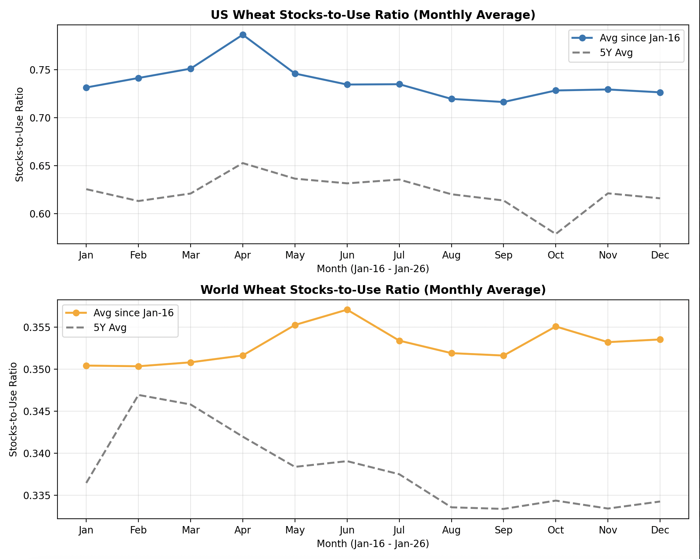

# Wheat

## Project n°1: Wheat WASDE Supply & Demand

**The Question**: Is the balance sheet actually tightening or is the market just reacting to inventory noise?

**Objective**: To decode the WASDE (World Agricultural Supply and Demand Estimates) reports, to go beyond static "Ending Stocks" to visualize dynamic Stocks-to-Use ratios, to identify trend throughout the marketing year

## Project n°2: SRW Wheat July–December Spread Analysis

**The Question**: How does the SRW wheat curve typically behave ahead of harvest, and does the current structure deviate from its historical seasonal profile?

**Objective**: To model the cost of carry on CBOT Soft Red Winter wheat during July - December period

